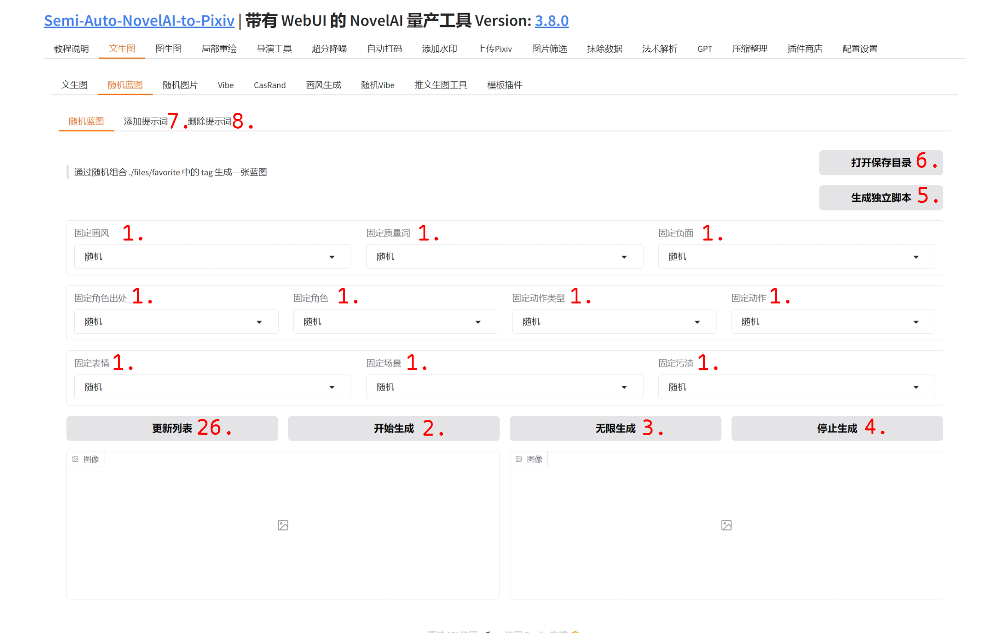
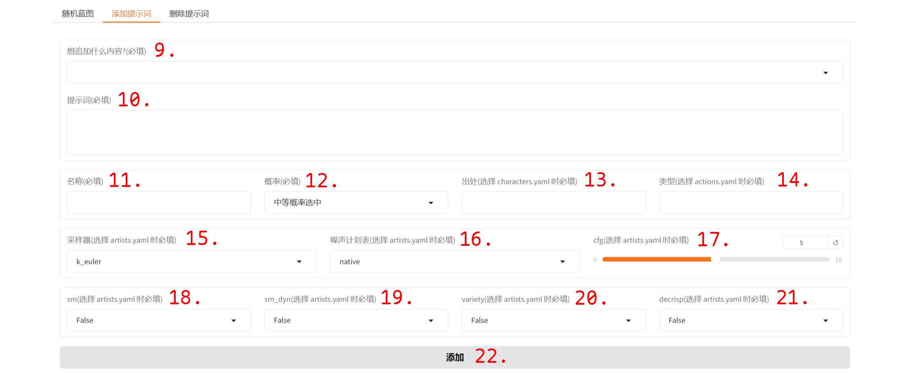

## 1. 提示词的随机与固定

这里不需要自己输入提示词, 会自动组装文件中的提示词并进行图片生成.

组装的顺序为：<角色>, <画风>, <审查>, <表情>, <动作>, <场景>, <污渍>, <质量词>

当你其中的某一项不想让其随机时, 通过对应的下拉列表将其变成固定的内容即可.

## 2. 开始生成

仅生成一次图片, 并在下方左侧展示.

## 3. 无限生成

无限次生成图片, 每生成一张后, 将在下方右侧展示.

## 4. 停止生成

无限生成时用来停止生成.

## 5. 生成独立脚本

注意, 由于现在浏览器节能模式的限制, 当浏览器窗口处于后台时, 下方右侧的图片不会自动切换, 导致无法继续生成下一张图片.

此按钮的意义在于你想要大量生成却又不想将浏览器置于前台时使用.

点击后, 运行项目目录中的 `run_stand_alone_scripts.bat` 即可独立执行该功能, 并且可关闭网页及控制台.

## 6. 打开保存目录

点击按钮, 将打开文生图的保存目录.

## 7. 添加提示词

提示词的添加有两种方式：

### 方法1

根据下方说明通过网页在线添加.

### 9. 文件

首先, 在此处的下拉框选择想添加 tag 到哪个文件, 该内容必填.

下面是文件对应的 tag 分类:

```yaml
actions.yaml       : 动作文件
artists.yaml       : 画风文件
characters.yaml    : 角色文件
emotions.yaml      : 表情文件
negative.yaml      : 负面提示词文件
prefixes.yaml      : 质量词文件
stains.yaml        : 污渍文件
surroundings.yaml  : 场景文件
```

### 10. 提示词

在此处文本框填写提示词, 该内容必填.

### 11. 名称

在此处文本框填写名称, 该内容必填.

### 12. 概率

在此处选择概率, 该内容必填. 此概率为随机蓝图生成时选择到该 tag 的概率.

### 13. 出处

在此处文本框填写出处, 当选择的文件为 characters.yaml 时, 该内容必填. 用于随机蓝图生成时固定角色出处.

### 14. 类型

在此处文本框填写类型, 当选择的文件为 actions.yaml 时, 该内容必填. 用于随机蓝图生成时固定动作类型.

### 15. 采样器

在此处选择采样器, 当选择的文件为 artists.yaml 时, 该内容必填. 用于随机蓝图生成时选中画风的采样器.

### 16. 噪声计划表

在此处选择噪声计划表, 当选择的文件为 artists.yaml 时, 该内容必填. 用于随机蓝图生成时选中画风的噪声计划表.

### 17. CFG

在此处选择 CFG, 当选择的文件为 artists.yaml 时, 该内容必填. 用于随机蓝图生成时选中画风的 CFG.

### 18. sm

在此处选择 sm, 当选择的文件为 artists.yaml 时, 该内容必填. 用于随机蓝图生成时选中画风的 sm.

### 19. sm_dyn

在此处选择 sm_dyn, 当选择的文件为 artists.yaml 时, 该内容必填. 用于随机蓝图生成时选中画风的 sm_dyn.

### 20. variety

在此处选择 variety, 当选择的文件为 artists.yaml 时, 该内容必填. 用于随机蓝图生成时选中画风的的 variety.

### 21. decrisp

在此处选择 decrisp, 当选择的文件为 artists.yaml 时, 该内容必填. 用于随机蓝图生成时选中画风的的 decrisp.

### 22. 添加

点击此按钮, 填写的内容将被添加到对应文件.

### 方法2

在 `./files/favorites` 目录中找到对应的文件, 打开后仿照格式进行添加.

添加内容时请注意 yaml 文件格式, 英文冒号后必须要有空格, 并且内容完全(比如画风文件必须包含 tag, cfg, sm...)

## 8. 删除提示词

### 23. 文件

在此处的下拉框选择想删除哪个文件的 tag.

### 24. 名称

在此处的下拉框选择想删除的 tag 的名称.

### 25. 删除

点击"删除", 当前选中的 tag 将被删除.

!!!WARNING
    该操作不可逆, 删除时请注意!

## 26. 更新列表

当进行完添加或删除提示词操作后, 可在随机蓝图页面点击"更新列表"按钮以刷新上方下拉列表.

更新后, 即可看到新加的提示词.
